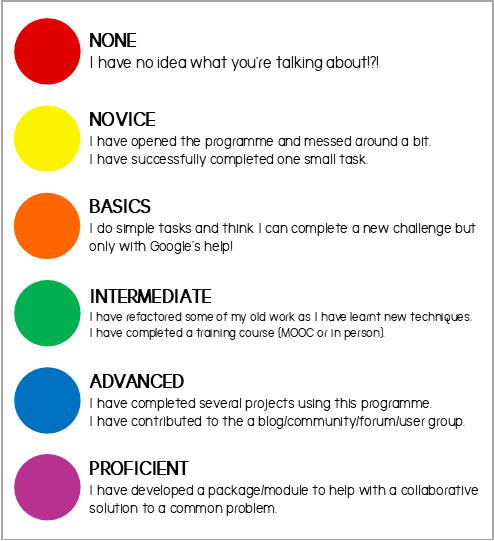
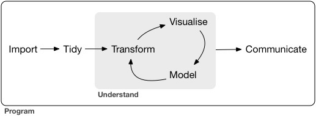

```{r front-matter-setup, include=FALSE}
knitr::opts_chunk$set(
  message = FALSE,
  warning = FALSE,
  dev = "png",
  cache = TRUE,
  cache.path = ".cache/",
  fig.path = "imgs/",
  fig.width = 11,
  fig.height = 5
)
options(htmltools.dir.version = FALSE)
```

layout: false
class: split-70 hide-slide-number
background-image: url("imgs/HEAD-Top-data-visualization-tools-for-small-business.png")
background-size: cover

.column.slide-in-left[
.sliderbox.vmiddle.shade_main.center[
.font5[Who are we?]]]
.column[
]

---

layout: false
class: split-60 hide-slide-number
background-image: url("imgs/codeScreen.jpg")
background-size: cover

.column.slide-in-left[
.sliderbox.vmiddle.shade_main.left[
  .font5[Gemma Dawson]<br>
  
]]

.column[.content.vmiddle.right[
### .white[`r anicon::faa("laptop", animate="float")`  www.icepack.ai]
### .white[`r anicon::faa("github", animate="float")`  @GemmaDawson]
### .white[`r anicon::faa("twitter", animate="float")`  @gemmadawsonza]
]]

---

layout: false
class: split-60 hide-slide-number
background-image: url("imgs/codeScreen.jpg")
background-size: cover

.column.slide-in-left[
.sliderbox.vmiddle.shade_main.left[
  .font5[Luis de Sousa]<br>
  
]]

.column[.content.vmiddle.right[
### .white[`r anicon::faa("github", animate="float")`  @luisdza]
### .white[`r anicon::faa("twitter", animate="float")`  @luis_de_sousa]
### .white[`r anicon::faa("laptop", animate="float")`  growninconsultation.com]
]]

---

layout: false
class: split-70 hide-slide-number
background-image: url("imgs/HEAD-Top-data-visualization-tools-for-small-business.png")
background-size: cover

.column.slide-in-left[
.sliderbox.vmiddle.shade_main.center[
.font5[Who are you?]]]
.column[
]

---

layout: false
class: middle center bg-main1



???

---


layout: false
class: split-20
.row.bg-main1[.content.vmiddle.center[
.white[.font5[Table of Contents]]
]]

.row[.content[.split-two[.column[.content.center[.color-main1[.font2[
Why R?<br><br>
Import<br><br>
Transform<br><br>
Visualise<br><br>
Model<br><br>
Communicate<br><br>
Questions & Resources
]]
]]
.column[.content.vmiddle.center[

]]
]]]

???
| Section   | Presenter | Time Allocation |
|-----------|-----------|-----------------|
| Why R? | Gemma  | 15 mins |
| Import | Luis  | 15 mins |
| Transform | Gemma | 15 mins |
| Visualise | Luis | 15 mins |
| Model | Gemma | 15 mins |
| Communicate | Luis | 15 mins |
| Questions & Resources | Gemma and Luis | 15 mins |
| Total | | 105 minuites|