```{r why-r-setup, include=FALSE}
knitr::opts_chunk$set(
  message = FALSE,
  warning = FALSE,
  dev = "svg",
  cache = TRUE,
  cache.path = ".cache/",
  fig.path = "imgs/",
  fig.width = 11,
  fig.height = 5
)
options(htmltools.dir.version = FALSE)
```

layout: false
class: split-20
.row.bg-main1[.content.vmiddle.center[
.white[.font5[What is R?]]
]]

.row[.content[.split-two[
.column[.content.vmiddle.center[

]]

.column[.content.vmiddle.center[
.color-main1[.font4[programming language and environment for statistical computing and graphics]]
]]
]]]

???
open-source

---

layout: false
class: split-20
background-image: url(imgs/BatmanVersusSuperman.jpg)
background-size: cover

.row.bg-main1[.content.vmiddle.center[
.white[.font5[R versus Python]]
]]

.row[.content[.split-two[
.column[.content.vmiddle.center[
.white[]
]]
.column[.content.vmiddle.center[
.white[]
]]
]]]

???
Python is great for data science too but scope extends beyond this
Python better suited to those with a comp sci background

R is better suited to data manipulation, analysis, communication


---

layout: false
class: split-20
background-image: url(imgs/BatmanVPresidentBusiness.jpg)
background-size: cover

.row.bg-main1[.content.vmiddle.center[
.white[.font5[R versus Excel]]
]]

.row[.content[.split-two[
.column[.content.vmiddle.center[
.white[]
]]
.column[.content.vmiddle.center[
.white[]
]]
]]]

???
Excel - complex tasks with large volumes of data is not easy!  Room for human error is high
R - transparent, repoducible analysis
R - automate & save time


---

layout: false
class: middle center bg-main1

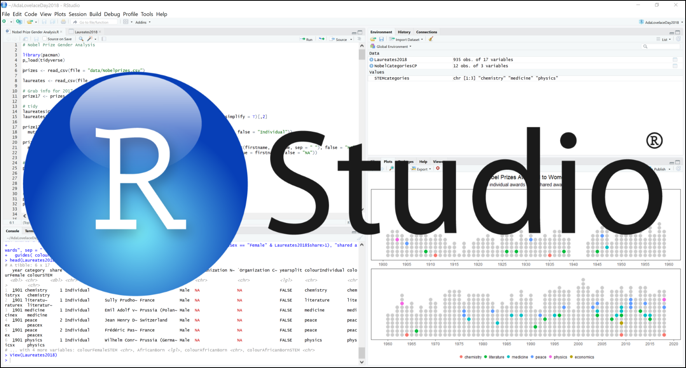

???
Explain sections
Integrated with GIT (yay - version control)
Accessible Cheatsheets

---

layout: false
class: middle center bg-main1

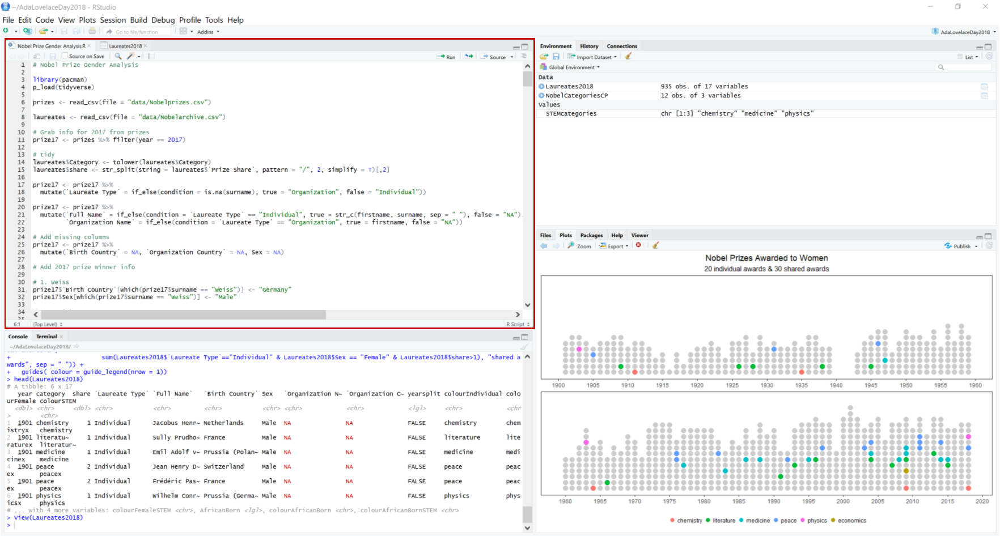

???

---

layout: false
class: middle center bg-main1

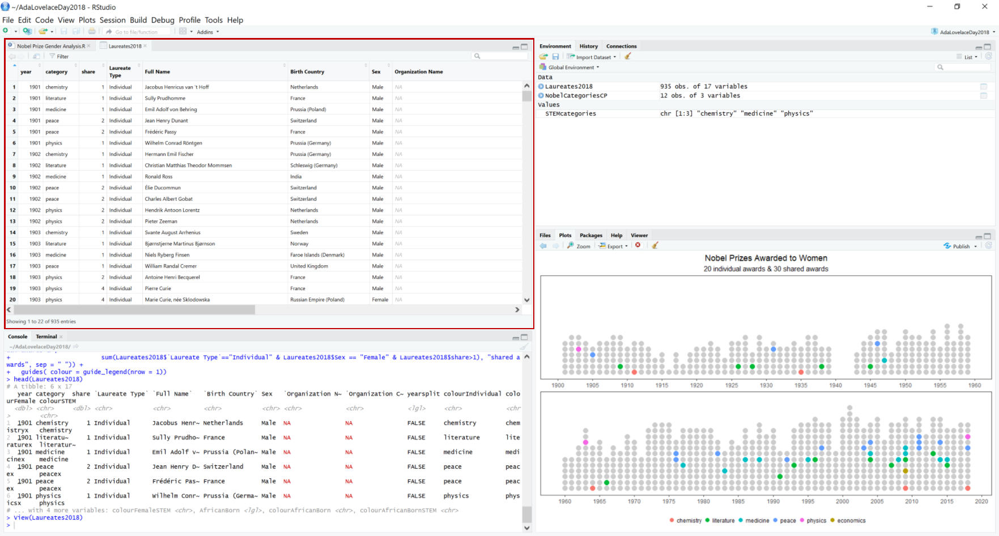

???

---

layout: false
class: middle center bg-main1

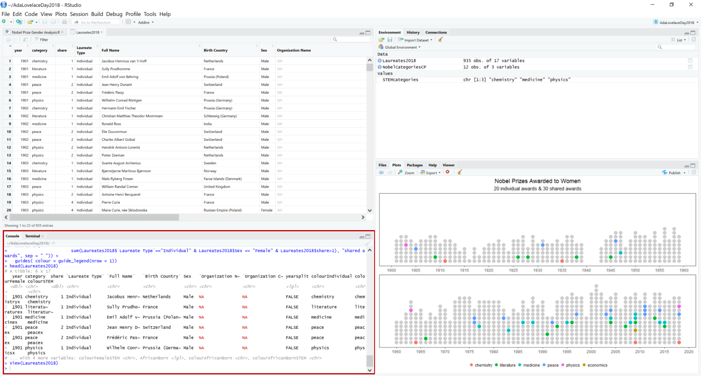

???

---

layout: false
class: middle center bg-main1

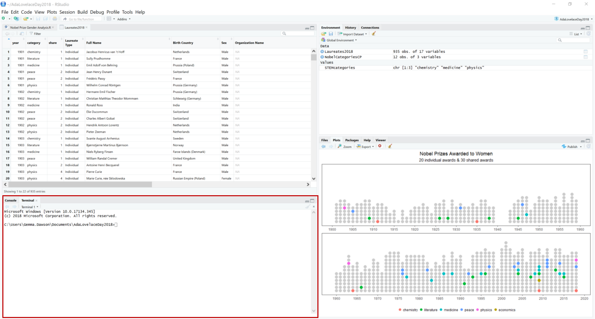

???

---

layout: false
class: middle center bg-main1

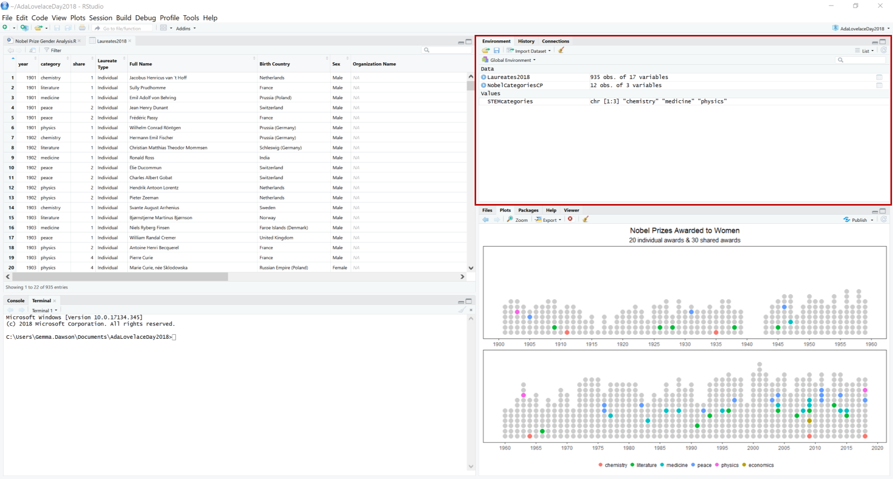

???

---

layout: false
class: middle center bg-main1

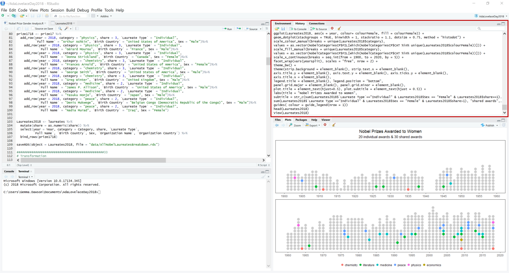

???

---

layout: false
class: middle center bg-main1

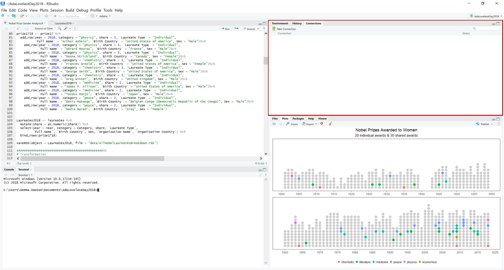

???

---

layout: false
class: middle center bg-main1

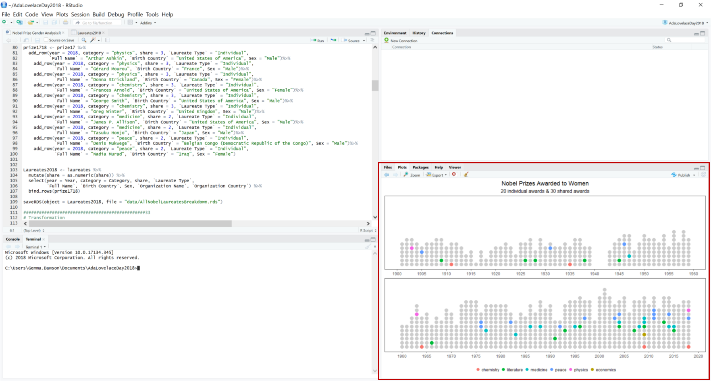

???

---

layout: false
class: middle center bg-main1

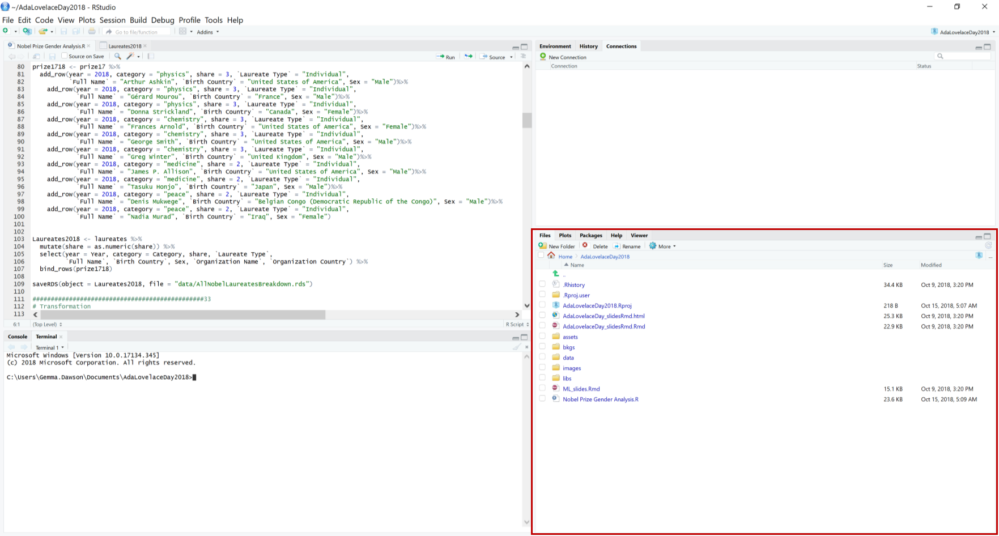

???

---

layout: false
class: middle center bg-main1

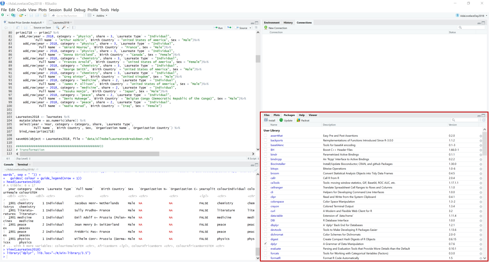

???

---

layout: false
class: middle center bg-main1

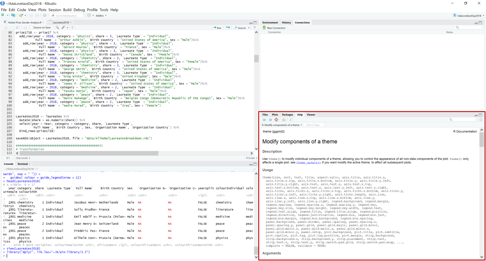

???

---

layout: true
class: split-two 

.column.bg-main1[.content.center[
.font5[.white[The Community]]
{{content}}
]]

.column[.split-four[
  .row[.content.vmiddle.center[
    # R Users & R ladies
  ]]
  .row[.content.vmiddle.center[
    # Twitter
  ]] 
  .row[.content.vmiddle.center[
    # Podcasts & Blogs
  ]]
  .row[.content.vmiddle.center[
    #  Stack Overflow
  ]]
]]

???

---

class: hide-row1-col2 hide-row2-col2 hide-row3-col2 hide-row4-col2

---

class: hide-row2-col2 hide-row3-col2 hide-row4-col2
count: false

 <br>


---

class: hide-row3-col2 hide-row4-col2
count: false


---

class: hide-row4-col2
count: false

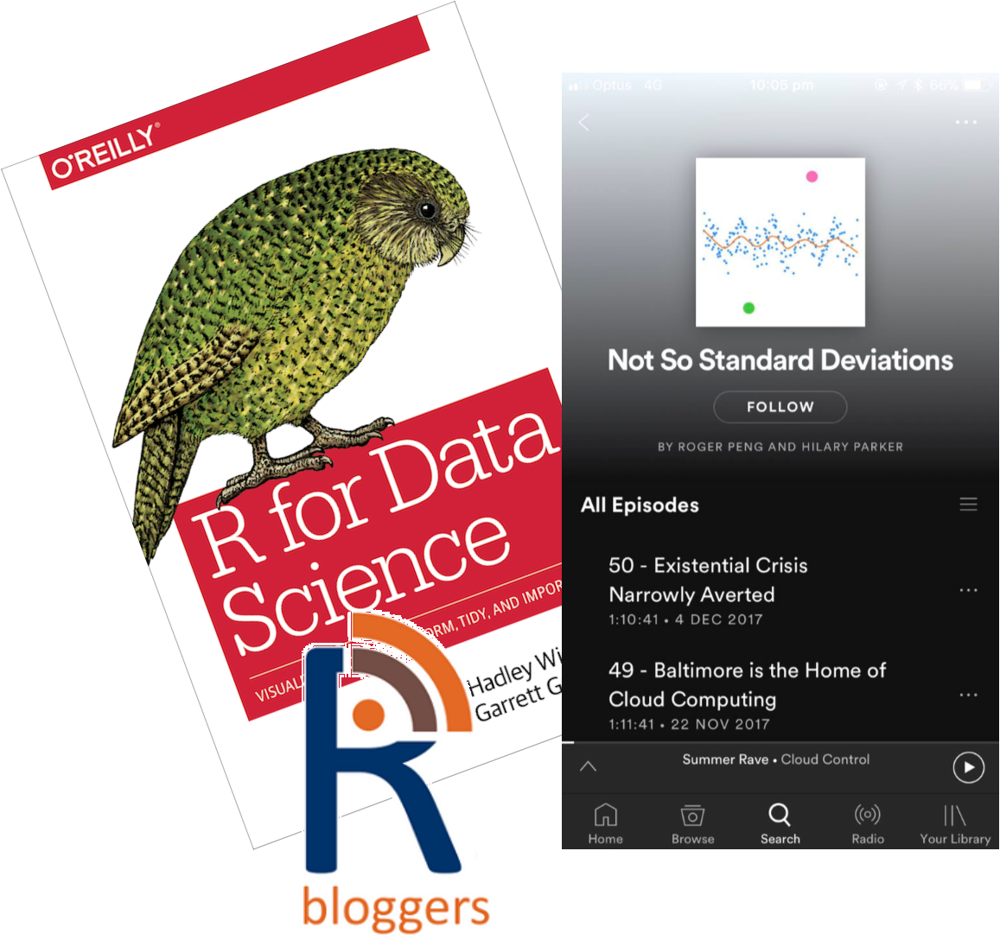

---

class: 
count: false


---

layout: false
class: split-20

.row.bg-main1[.content.vmiddle.center[
.white[.font5[Packages]]
]]

.row[.content.vmiddle.center[

]]

???


---

layout: true
class: split-two 

.column.bg-main1[.content.center[
.font5[.white[The Tidyverse]]
{{content}}
]]

.column[.split-five[
  .row[.content.vmiddle.center[
    # simpler *
  ]]
  .row[.content.vmiddle.center[
    # human-readable
  ]] 
  .row[.content.vmiddle.center[
    # faster
  ]]
  .row[.content.vmiddle.center[
    #  more intelligent
  ]]
  .row[.content.vmiddle.center[
    # magrittr's pipe
  ]]
]]

???
Preach the good word of Tidyverse
Why Tidyverse

---

class: hide-row1-col2 hide-row2-col2 hide-row3-col2 hide-row4-col2 hide-row5-col2

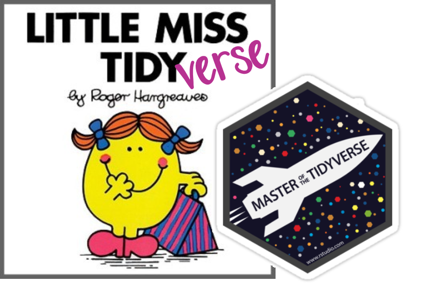

---

class: hide-row2-col2 hide-row3-col2 hide-row4-col2 hide-row5-col2
count: false


---

class: hide-row3-col2 hide-row4-col2 hide-row5-col2
count: false


---

class: hide-row4-col2 hide-row5-col2
count: false


---

class: hide-row5-col2
count: false


---

class: 
count: false


