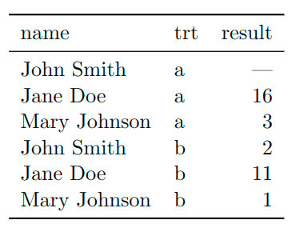
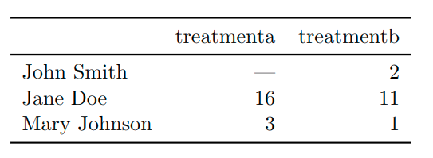
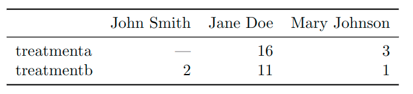

```{r transform-setup, include=FALSE}
knitr::opts_chunk$set(
  message = FALSE,
  warning = FALSE,
  dev = "png",
  cache = TRUE,
  cache.path = ".cache/",
  fig.path = "imgs/",
  fig.width = 11,
  fig.height = 5
)
options(htmltools.dir.version = FALSE)
```

class: split-70 hide-slide-number
background-image: url("imgs/HEAD-Top-data-visualization-tools-for-small-business.png")
background-size: cover

.column.slide-in-left[
.sliderbox.vmiddle.shade_main.center[
.font5[Tidy & Transform]]]
.column[
]

---

layout: false
class: split-20

.row.bg-main1[.content.vmiddle.center[
.font4[Wait, what do you mean tidy?]
]]

.row[.content.vmiddle.center[
.color-main1[.font4[Happy families are all alike; <br> every unhappy family is unhappy in its own way]
<br><br><br><br> .right[.font3[Leo Tolstoy]]]
]]


???

---

layout: true
class: split-20

.row.bg-main1[.content.vmiddle.center[
.font4[Wait, what do you mean tidy?]
]]

.row[.split-two[
.column[.content.vmiddle.center[
{{content}}
]]
.column[.content.vmiddle.center[

]]
]]

???

---

class: hide-row2-col2

---

class: hide-row2-col2
count:false


---

class: hide-row2-col2
count:false
 <br>


---

class: 
count:false
 <br>


---

class: hide-row2-col1
count: false

---

layout: false
class: split-20
count: false

.row.bg-main1[.content.vmiddle.center[
.font4[Wait, what do you mean tidy?]
]]

.row[.split-two[
.column[.content.vmiddle.left[
# each variable forms a column 
<br>
# .white[each observation forms a row]
<br>
# .white[each type of observational unit forms a table]
<br> 
]]
.column[.content.vmiddle.center[

]]
]]

???


---

layout: false
class: split-20
count: false

.row.bg-main1[.content.vmiddle.center[
.font4[Wait, what do you mean tidy?]
]]

.row[.split-two[
.column[.content.vmiddle.left[
# each variable forms a column 
<br>
# each observation forms a row 
<br>
# .white[each type of observational unit forms a table]
<br> 
]]
.column[.content.vmiddle.center[

]]
]]

???

---

layout: false
class: split-20
count: false

.row.bg-main1[.content.vmiddle.center[
.font4[Wait, what do you mean tidy?]
]]

.row[.split-two[
.column[.content.vmiddle.left[
# each variable forms a column 
<br>
# each observation forms a row 
<br>
# each type of observational unit forms a table 
<br> 
]]
.column[.content.vmiddle.center[

]]
]]

???

---

layout: false
class: split-20

.row.bg-main1[.content.vmiddle.center[
.font4[Billboard Top 100 from 2000]
]]

.row[.content.left[
```{r include=FALSE}
  library(tidyverse)
  raw_billboard <- read_rds(path = "data/billboard.rds")
```
```{r}
  head(raw_billboard)
```
]]


???

---

layout: true
class: split-20

.row.bg-main1[.content.vmiddle.center[
.font4[So, how do we tidy our data?]
]]

.row[.split-two[
.column[.content.vmiddle.center[

]]
.column[.content.vmiddle.center[

]]
]]


???

---

class: hide-row2-col2

---

class: 
count: false

---

layout: false
class: split-20

.row.bg-main1[.content.vmiddle.center[
.font4[Okay, let's try it out!]
]]

.row[.content.left[
```{r}
  library(tidyverse)
  raw_billboard %>% slice(1)
```
]]

???

---

layout: false
class: split-20
count: false

.row.bg-main1[.content.vmiddle.center[
.font4[Okay, let's try it out!]
]]

.row[.content.left[
```{r}
  library(tidyverse)
  raw_billboard %>% slice(1)
  raw_billboard %>% slice(1) %>% 
    gather(key = "week", value = "rank", wk1, wk2, wk3, wk4)  #<<
```
]]

???

---

layout: false
class: split-20

.row.bg-main1[.content.vmiddle.center[
.font4[Awesome, let's do it!]
]]

.row[.content.left[
```{r}
  tidy_billboard <- raw_billboard %>% 
                        gather(key = "week", value = "rank", wk1, wk2, wk3, wk4)
```
]]

???

---

layout: false
class: split-20
count: false

.row.bg-main1[.content.vmiddle.center[
.font4[Awesome, let's do it!]
]]

.row[.content.left[
```{r}
  tidy_billboard <- raw_billboard %>% 
                        gather(key = "week", value = "rank", wk1, wk2, wk3, wk4)
  head(tidy_billboard)
```
]]

???

---

layout: false
class: split-20

.row.bg-main1[.content.vmiddle.center[
.font4[Transform - Arrange]
]]

.row[.content.left[
```{r}
  tidy_billboard <- tidy_billboard %>% 
                        arrange(artist, track)  #<<
```
]]

???

---

layout: false
class: split-20
count: false

.row.bg-main1[.content.vmiddle.center[
.font4[Transform - Arrange]
]]

.row[.content.left[
```{r}
  tidy_billboard <- tidy_billboard %>% 
                        arrange(artist, track)  #<<
  head(tidy_billboard)
```
]]

???

---

layout: false
class: split-20

.row.bg-main1[.content.vmiddle.center[
.font4[Transform - Mutate]
]]

.row[.content.left[
```{r}
  library(lubridate)
  tidy_billboard_pop <- tidy_billboard %>% 
                            mutate(month.entered = month(tidy_billboard$date.entered, label = T))  #<<
```
]]

???

---

layout: false
class: split-20
count: false

.row.bg-main1[.content.vmiddle.center[
.font4[Transform - Mutate]
]]

.row[.content.left[
```{r}
  library(lubridate)
  tidy_billboard_pop <- tidy_billboard %>% 
                            mutate(month.entered = month(tidy_billboard$date.entered, label = T))  #<<
  head(tidy_billboard_pop)
```
]]

???

---

layout: false
class: split-20

.row.bg-main1[.content.vmiddle.center[
.font4[Transform - Filter]
]]

.row[.content.left[
```{r message=FALSE}
  tidy_billboard_pop <- tidy_billboard %>% 
                            filter(genre == "Pop" & month(date.entered) < 7)  #<<
```
]]

???

---

layout: false
class: split-20
count: false

.row.bg-main1[.content.vmiddle.center[
.font4[Transform - Filter]
]]

.row[.content.left[
```{r message=FALSE}
  tidy_billboard_pop <- tidy_billboard %>% 
                            filter(genre == "Pop" & month(date.entered) < 7)  #<<
  head(tidy_billboard_pop)
```
]]

???

---

layout: false
class: split-20

.row.bg-main1[.content.vmiddle.center[
.font4[Transform - Select]
]]

.row[.content.left[
```{r eval=F}
  tidy_billboard_pop <- tidy_billboard_pop %>% 
                            select(-genre)  #<<
```
]]

???

---

layout: false
class: split-20
count: false

.row.bg-main1[.content.vmiddle.center[
.font4[Transform - Select]
]]

.row[.content.left[
```{r}
  tidy_billboard_pop <- tidy_billboard_pop %>% 
                            select(-genre)  #<<
  head(tidy_billboard_pop)
```
]]

???


---

layout: false
class: split-20

.row.bg-main1[.content.vmiddle.center[
.font4[Transform - Summarise]
]]

.row[.content.left[
```{r}
  tidy_billboard_pop %>% 
    summarise(mean.rank = mean(rank, na.rm = T))  #<<
```
]]

???

---

layout: false
class: split-20

.row.bg-main1[.content.vmiddle.center[
.font4[Transform - Group By & Summarise]
]]

.row[.content.left[
```{r}
  tidy_billboard_pop %>% 
      group_by(artist) %>%  #<<
      summarise(mean.rank = mean(rank, na.rm = T)) #<<
```
]]

???

---

layout: false
class: split-20

.row.bg-main1[.content.vmiddle.center[
.font4[Transform]
]]

.row[.content.left[
```{r eval=FALSE}
  tidy_billboard
```
]]

???

---

layout: false
class: split-20
count: false

.row.bg-main1[.content.vmiddle.center[
.font4[Transform]
]]

.row[.content.left[
```{r eval=FALSE}
  tidy_billboard %>% 
      filter(genre == "Pop" & month(date.entered) < 7)
```
]]

???

---

layout: false
class: split-20
count: false

.row.bg-main1[.content.vmiddle.center[
.font4[Transform]
]]

.row[.content.left[
```{r eval=FALSE}
  tidy_billboard %>% 
      filter(genre == "Pop" & month(date.entered) < 7) %>% 
      select(-genre)
```
]]

???

---

layout: false
class: split-20
count: false

.row.bg-main1[.content.vmiddle.center[
.font4[Transform]
]]

.row[.content.left[
```{r eval=FALSE}
  tidy_billboard %>% 
      filter(genre == "Pop" & month(date.entered) < 7) %>% 
      select(-genre) %>% 
      group_by(artist)
```
]]

???

---

layout: false
class: split-20
count: false

.row.bg-main1[.content.vmiddle.center[
.font4[Transform]
]]

.row[.content.left[
```{r eval=FALSE}
  tidy_billboard %>% 
      filter(genre == "Pop" & month(date.entered) < 7) %>% 
      select(-genre) %>% 
      group_by(artist) %>% 
      summarise(mean.rank = mean(rank, na.rm = T))
```
]]

???

---

layout: false
class: split-20
count: false

.row.bg-main1[.content.vmiddle.center[
.font4[Transform]
]]

.row[.content.left[
```{r}
  tidy_billboard %>% 
      filter(genre == "Pop" & month(date.entered) < 7) %>% 
      select(-genre) %>% 
      group_by(artist) %>% 
      summarise(mean.rank = mean(rank, na.rm = T))
```
]]

???

