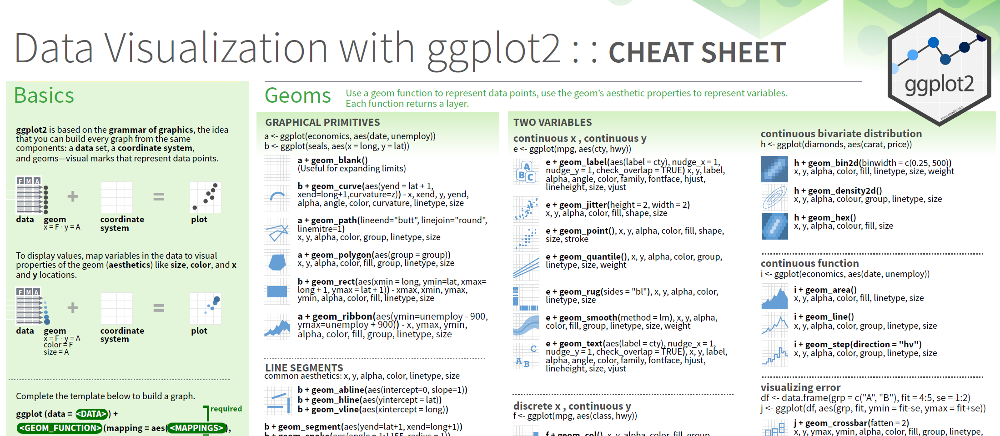

```{r visualise-setup, include=FALSE}
knitr::opts_chunk$set(
  message = FALSE,
  warning = TRUE,
  dev = "png",
  cache = TRUE,
  cache.path = ".cache/",
  fig.path = "imgs/",
  fig.width = 11,
  fig.height = 5
)
options(htmltools.dir.version = FALSE)
library(ggplot2)
library(gapminder)
library(sf)
```

layout: false
class: split-70 hide-slide-number
background-image: url("imgs/HEAD-Top-data-visualization-tools-for-small-business.png")
background-size: cover

.column.slide-in-left[
.sliderbox.vmiddle.shade_main.center[
.font5[Visualise]]]
.column[
]

---

layout: false
class: split-20

.row.bg-main1[.content.vmiddle.center[
.white[.font5[Data Visualisation]]
]]

.row[.content.vmiddle.center[

]]

---

layout: false
class: split-20
.row.bg-main1[.content.vmiddle.center[
.white[.font5[ggplot2]]
]]

.row[
.content.vmiddle[
.center[]
RStudio Cheat Sheets - https://www.rstudio.com/resources/cheatsheets/
]
]

---

class: split-20

.row.bg-main1[.content.vmiddle.center[
 .white[.font5[ggplot2]]
]]
.row[
.split-40[
.column[.content[
```{r plot1, eval=FALSE}
ggplot(gapminder) #<<
```
.bottom_abs.width100[
This example inspired by **Gina Reynolds**, **Garrick Aden-Buie** and **Emi Tanaka**.
]
]]
.column[.content.center[
.img90[
```{r output1, ref.label="plot1", echo=FALSE, out.width="90%", fig.retina=2, fig.height=6, cache=T}
```
]]]]]

---

class: split-20
count: false

.row.bg-main1[.content.vmiddle.center[
 .white[.font5[ggplot2]]
]]
.row[
.split-40[
.column[.content[
```{r plot2, eval=FALSE}
ggplot(gapminder) +
  aes(x = gdpPercap, y = lifeExp) #<<
```
.bottom_abs.width100[
Note: .font-mono[aes] normally sits within .font-mono[ggplot] function!
]
]]
.column[.content.center[
.img90[
```{r output2, ref.label="plot2", echo=FALSE, out.width="90%", fig.retina=2, fig.height=6, cache=T}
```
]]]]]

---

class: split-20
count: false

.row.bg-main1[.content.vmiddle.center[
 .white[.font5[ggplot2]]
]]
.row[
.split-40[
.column[.content[
```{r plot3, eval=FALSE}
ggplot(gapminder) +
  aes(x = gdpPercap, y = lifeExp) +
  geom_point() #<<
```
]]
.column[.content.center[
.img90[
```{r output3, ref.label="plot3", echo=FALSE, out.width="90%", fig.retina=2, fig.height=6, cache=T, cache=T}
```
]]]]]

---

class: split-20
count: false

.row.bg-main1[.content.vmiddle.center[
 .white[.font5[ggplot2]]
]]
.row[
.split-40[
.column[.content[
```{r plot4, eval=FALSE}
ggplot(gapminder) +
  aes(x = gdpPercap, y = lifeExp) +
  geom_point() +
  scale_x_log10() #<<
```
]]
.column[.content.center[
.img90[
```{r output4, ref.label="plot4", echo=FALSE, out.width="90%", fig.retina=2, fig.height=6, cache=T}
```
]]]]]

---

class: split-20
count: false

.row.bg-main1[.content.vmiddle.center[
 .white[.font5[ggplot2]]
]]
.row[
.split-40[
.column[.content[
```{r plot5, eval=FALSE}
ggplot(gapminder) +
  aes(x = gdpPercap, y = lifeExp) +
  geom_point() +
  scale_x_log10() +
  labs(x = "GDP per capita") #<<
```
]]
.column[.content.center[
.img90[
```{r output5, ref.label="plot5", echo=FALSE, out.width="90%", fig.retina=2, fig.height=6, cache=T}
```
]]]]]

---

class: split-20
count: false

.row.bg-main1[.content.vmiddle.center[
 .white[.font5[ggplot2]]
]]
.row[
.split-40[
.column[.content[
```{r plot6, eval=FALSE}
ggplot(gapminder) +
  aes(x = gdpPercap, y = lifeExp) +
  geom_point() +
  scale_x_log10() +
  labs(x = "GDP per capita") +
  labs(y = "Life Expectancy") #<<
```
]]
.column[.content.center[
.img90[
```{r output6, ref.label="plot6", echo=FALSE, out.width="90%", fig.retina=2, fig.height=6, cache=T}
```
]]]]]

---

class: split-20
count: false

.row.bg-main1[.content.vmiddle.center[
 .white[.font5[ggplot2]]
]]
.row[
.split-40[
.column[.content[
```{r plot7, eval=FALSE}
ggplot(gapminder) +
  aes(x = gdpPercap, y = lifeExp) +
  geom_point() +
  scale_x_log10() +
  labs(x = "GDP per capita") +
  labs(y = "Life Expectancy") +
  labs(title="How Does Income Relate to Life Expectancy?") #<<
```
]]
.column[.content.center[
.img90[
```{r output7, ref.label="plot7", echo=FALSE, out.width="90%", fig.retina=2, fig.height=6, cache=T}
```
]]]]]

---

class: split-20
count: false

.row.bg-main1[.content.vmiddle.center[
 .white[.font5[ggplot2]]
]]
.row[
.split-40[
.column[.content[
```{r plot8, eval=FALSE}
ggplot(gapminder) +
  aes(x = gdpPercap, y = lifeExp) +
  geom_point() +
  scale_x_log10() +
  labs(x = "GDP per capita") +
  labs(y = "Life Expectancy") +
  labs(title="How Does Income Relate to Life Expectancy?") + 
  labs(subtitle="Data collected from http://www.gapminder.org/data/") #<<
```
]]
.column[.content.center[
.img90[
```{r output8, ref.label="plot8", echo=FALSE, out.width="90%", fig.retina=2, fig.height=6, cache=T}
```
]]]]]


---

class: split-20
count: false

.row.bg-main1[.content.vmiddle.center[
 .white[.font5[ggplot2]]
]]
.row[
.split-40[
.column[.content[
```{r plot9, eval=FALSE}
ggplot(gapminder) +
  aes(x = gdpPercap, y = lifeExp) +
  geom_point() +
  scale_x_log10() +
  labs(x = "GDP per capita") +
  labs(y = "Life Expectancy") +
  labs(title="How Does Income Relate to Life Expectancy?") + 
  labs(subtitle="Data collected from http://www.gapminder.org/data/") +
  aes(color = continent) #<<
```
]]
.column[.content.center[
.img90[
```{r output9, ref.label="plot9", echo=FALSE, out.width="90%", fig.retina=2, fig.height=6, cache=T}
```
]]]]]

---

class: split-20
count: false

.row.bg-main1[.content.vmiddle.center[
 .white[.font5[ggplot2]]
]]
.row[
.split-40[
.column[.content[
```{r plot10, eval=FALSE}
ggplot(gapminder) +
  aes(x = gdpPercap, y = lifeExp) +
  geom_point() +
  scale_x_log10() +
  labs(x = "GDP per capita") +
  labs(y = "Life Expectancy") +
  labs(title="How Does Income Relate to Life Expectancy?") + 
  labs(subtitle="Data collected from http://www.gapminder.org/data/") +
  aes(color = continent) +
  theme_bw(base_size=16) #<<
```
]]
.column[.content.center[
.img90[
```{r output10, ref.label="plot10", echo=FALSE, out.width="90%", fig.retina=2, fig.height=6, cache=T}
```
]]]]]

---
class: split-20
count: false

.row.bg-main1[.content.vmiddle.center[
 .white[.font5[ggplot2]]
]]
.row[
.split-40[
.column[.content[
```{r plot11, eval=FALSE}
ggplot(gapminder) +
  aes(x = gdpPercap, y = lifeExp) +
  geom_point() +
  scale_x_log10() +
  labs(x = "GDP per capita") +
  labs(y = "Life Expectancy") +
  labs(title="How Does Income Relate to Life Expectancy?") + 
  labs(subtitle="Data collected from http://www.gapminder.org/data/") +
  aes(color = continent) +
  theme_bw(base_size=16)
```
<br>
.center[
## Book recommendation
## .orange[Factfulness] by .orange[Hans Rosling]
]]]
.column[.content.center[
.img90[
```{r output11, ref.label="plot11", echo=FALSE, out.width="90%", fig.retina=2, fig.height=6, cache=T}
```
]]]]]

---

class: split-20

.row.bg-main1[.content.vmiddle.center[
 .white[.font5[.orange[Import] + Transform + Visualise]]
]]
.row[
.split-40[
.column[.content[
```{r plot12, eval=FALSE}
library(sf)
library(ggplot2)
library(dplyr)
geo <- st_read("data/LocalMunicipalities2011.shp", quiet = TRUE)
head(geo) #<<
```
]]
.column[.content.center[
.img90[
```{r output12, ref.label="plot12", echo=FALSE, out.width="90%", fig.retina=2, fig.height=6, cache=T}
```
]]]]]

---

class: split-20

.row.bg-main1[.content.vmiddle.center[
 .white[.font5[Import + .orange[Transform] + Visualise]]
]]
.row[
.split-40[
.column[.content[
```{r plot13, eval=FALSE}
library(sf)
library(ggplot2)
library(dplyr)
geo <- st_read("data/LocalMunicipalities2011.shp", quiet = TRUE)
#head(geo)
largestMunicipalities <- geo %>%
  select(AREA, MUNICNAME) %>%
  arrange(desc(AREA)) %>%
  slice(1:10)
largestMunicipalities #<<
```
]]
.column[.content.center[
.img90[
```{r output13, ref.label="plot13", echo=FALSE, out.width="90%", fig.retina=2, fig.height=6, cache=T}
```
]]]]]

---

class: split-20

.row.bg-main1[.content.vmiddle.center[
 .white[.font5[Import + Transform + .orange[Visualise]]]
]]
.row[
.split-40[
.column[.content[
```{r plot14, eval=FALSE}
library(sf)
library(ggplot2)
library(dplyr)
geo <- st_read("data/LocalMunicipalities2011.shp", quiet = TRUE)
#head(geo)
largestMunicipalities <- geo %>%
  select(AREA, MUNICNAME) %>%
  arrange(desc(AREA)) %>%
  slice(1:10)
#largestMunicipalities
ggplot() +
  geom_sf(data = geo) #<<
```
]]
.column[.content.center[
.img90[
```{r output14, ref.label="plot14", echo=FALSE, out.width="90%", fig.retina=2, fig.height=6, cache=T}
```
]]]]]

---

class: split-20

.row.bg-main1[.content.vmiddle.center[
 .white[.font5[Import + Transform + .orange[Visualise]]]
]]
.row[
.split-40[
.column[.content[
```{r plot15, eval=FALSE}
library(sf)
library(ggplot2)
library(dplyr)
geo <- st_read("data/LocalMunicipalities2011.shp", quiet = TRUE)
#head(geo)
largestMunicipalities <- geo %>%
  select(AREA, MUNICNAME) %>%
  arrange(desc(AREA)) %>%
  slice(1:10)
#largestMunicipalities
ggplot() +
  geom_sf(data = geo) +
  geom_sf(data = largestMunicipalities, aes(fill = MUNICNAME)) #<<
```
]]
.column[.content.center[
.img90[
```{r output15, ref.label="plot15", echo=FALSE, out.width="90%", fig.retina=2, fig.height=6, cache=T}
```
]]]]]
---

class: split-20

.row.bg-main1[.content.vmiddle.center[
 .white[.font5[Import + Transform + .orange[Visualise]]]
]]
.row[
.split-40[
.column[.content[
```{r plot16, eval=FALSE}
library(sf)
library(ggplot2)
library(dplyr)
geo <- st_read("data/LocalMunicipalities2011.shp", quiet = TRUE)
#head(geo)
largestMunicipalities <- geo %>%
  select(AREA, MUNICNAME) %>%
  arrange(desc(AREA)) %>%
  slice(1:10)
#largestMunicipalities
ggplot() +
  geom_sf(data = geo) +
  geom_sf(data = largestMunicipalities, aes(fill = MUNICNAME)) +
  labs(title= "South Africa's largest municipalities by area") #<<
```
]]
.column[.content.center[
.img90[
```{r output16, ref.label="plot16", echo=FALSE, out.width="90%", fig.retina=2, fig.height=6, cache=T}
```
]]]]]
---

class: split-20

.row.bg-main1[.content.vmiddle.center[
 .white[.font5[Import + Transform + .orange[Visualise]]]
]]
.row[
.split-40[
.column[.content[
```{r plot17, eval=FALSE}
library(sf)
library(ggplot2)
library(dplyr)
geo <- st_read("data/LocalMunicipalities2011.shp", quiet = TRUE)
#head(geo)
largestMunicipalities <- geo %>%
  select(AREA, MUNICNAME) %>%
  arrange(desc(AREA)) %>%
  slice(1:10)
#largestMunicipalities
ggplot() +
  geom_sf(data = geo) +
  geom_sf(data = largestMunicipalities, aes(fill = MUNICNAME)) +
  labs(title= "South Africa's largest municipalities by area") +
  theme_bw(base_size=12) #<<
```
]]
.column[.content.center[
.img90[
```{r output17, ref.label="plot17", echo=FALSE, out.width="90%", fig.retina=2, fig.height=6, cache=T}
```
]]]]]