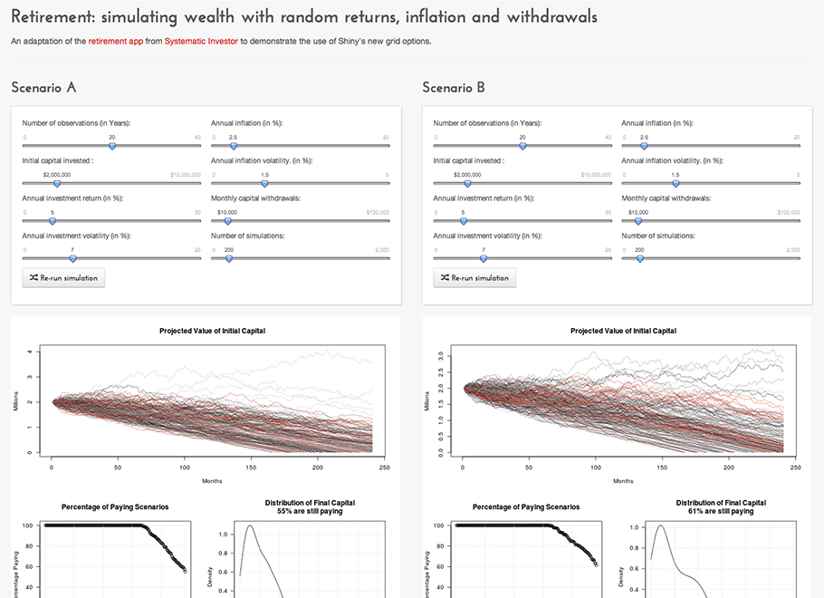
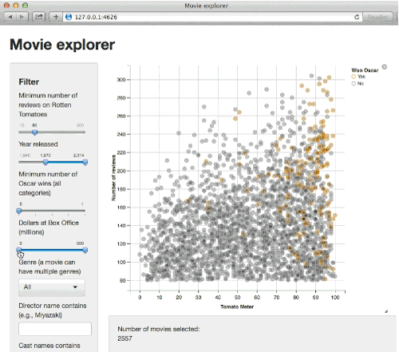

```{r communicate-setup, include=FALSE}
knitr::opts_chunk$set(
  message = FALSE,
  warning = FALSE,
  dev = "png",
  cache = TRUE,
  cache.path = ".cache/",
  fig.path = "imgs/",
  fig.width = 11,
  fig.height = 5
)
options(htmltools.dir.version = FALSE)
```

layout: false

class: split-70 hide-slide-number
background-image: url("imgs/HEAD-Top-data-visualization-tools-for-small-business.png")
background-size: cover

.column.slide-in-left[
.sliderbox.vmiddle.shade_main.center[
.font5[Communicate]]]
.column[
]

---

layout: false
class: split-20
.row.bg-main1[.content.vmiddle.center[
.white[.font5[Communication]]
]]

.row[.content[
.color-main1[.font2[
* Reproducable documents, presentations, and reports
* Interactive web-apps and dashboards
.content.center[


]
]]
]]

---

layout: false
class: split-20
.row.bg-main1[.content.vmiddle.center[
.white[.font5[Rmarkdown]]
]]

.row[.content[
.color-main1[.font2[
* Output Formats
.content.center[

<br>
]
* A reproducible workflow
]]
]]

---

layout: false
class: split-20

.row.bg-main1[.content.vmiddle.center[
.white[.font5[Example of rmarkdown report]]
]]

.row[.content.center[

]]

---

layout: false
class: split-20
.row.bg-main1[.content.vmiddle.center[
.white[.font5[Shiny]]
]]

.row[.content[
.color-main1[.font2[
* Shiny combines the computational power of R with the interactivity of the modern web.
.content.center[


]
]]
]]

---

layout: false
class: split-20

.row.bg-main1[.content.vmiddle.center[
.white[.font5[Shiny Dashboard]]
]]

.row[.content.center[

]]
